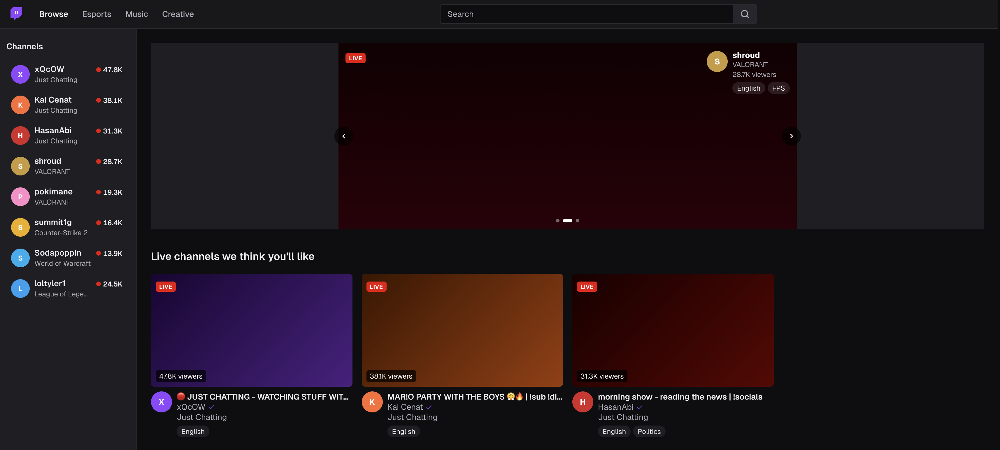

# Twitch UI Scaffolding

A faithful recreation of Twitch's frontend components and design system, built with Next.js and Tailwind CSS. Use this as a starting point for sites that want to adopt Twitch's visual language.



## Components

| Component | Description |
|---|---|
| `TopNav` | Fixed top navigation bar with logo, search, and user controls |
| `LeftSidebar` | Collapsible sidebar with followed channels and recommended streams |
| `HeroCarousel` | Full-width featured stream carousel |
| `StreamCard` | Stream preview card with thumbnail, live badge, viewer count, and tags |
| `CategoryCard` | Game/category card with artwork and viewer count |

## Design tokens

All colors are defined as Tailwind CSS theme tokens in `app/globals.css` and mirror Twitch's actual palette:

| Token | Value | Usage |
|---|---|---|
| `page-bg` | `#0e0e10` | Page background |
| `nav-bg` | `#18181b` | Top nav background |
| `sidebar-bg` | `#1f1f23` | Sidebar background |
| `purple` | `#9147ff` | Primary brand color |
| `live-red` | `#eb0400` | Live indicator |
| `prime-blue` | `#00a8fc` | Prime Gaming accent |
| `text-primary` | `#efeff1` | Primary text |
| `text-muted` | `#adadb8` | Secondary/muted text |

## Getting started

```bash
pnpm install
pnpm run dev   # http://localhost:3000
```

## Stack

- **Next.js 16** (App Router, Turbopack)
- **Tailwind CSS v4**
- **TypeScript**
